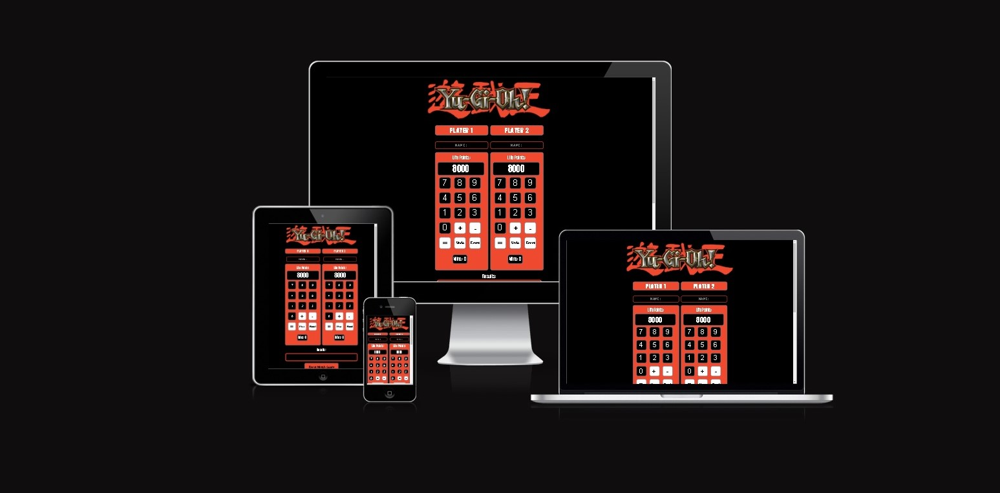

# Yugioh Dueling Calculator
This website is a tool inteded for users playing the YuGiOh trading card game.

The game is a two player game and each player statrs on 8000 life points and can use the calculator within the website to keep track of their life points

Each player attacks with different monster cards until one player reaches 0 life points. At this point the life points will return to 8000 for each user indicating the end of a round or game.

Each game in YuGiOh is best of 3 and the wins section of the calculator keeps track of each win and once a player reaches 2 wins the score resets for both players.

The website also has other features for the users such as a timer to keep track of round times (40 minutes) and a dice and coin tool so users dont need any of these items pysically as they can use them within the app as needed.

## Contents
* [Features](#Features)
  * [Logo](#Logo)
  * [Username](#Username)
  * [Calculator](#Calculator)
  * [Score Counter](#Score-Counter)
  * [Results Screen](#Results-Screen)
  * [Reset Match Score](#Reset-Match-Score)
  * [Timer](#Timer)
  * [Dice and Coin](#Dice-and-Coin)
  * [Navigation](#Navigation)

* [Wireframes](#Wireframes)

* [Testing](#Testing)

* [Bugs](#Bugs)
  * [Solved Bugs](#Solved-Bugs)
  * [Unsolved Bugs](#Unsolved-Bugs)

* [Validator Testing](#Validator-Testing)

* [Accessibility](#Accessibility)

* [Deployment](#Deployment)

* [Credits](#Credits)
  * [Content](#Content)
  * [Media](#Media)

  ## Features

### Logo
* The YuGiOh logo is positioned at the top center of the page and gives clarity to the user on what game this tool is used for.

### Username

* The name input field allows users to input their names and save it to the conole to be recalled trought the match for differnet results.
* This adds functionality to website allowing the user to keep track of which calculator they are using.
* It adds a personal touch for the users to enhance the user expierence.
* Altenatively if the users decide to not input their names a generic player 1 and player 2 name is used on the result screen.

### Calculator

* Each player has a separate calculator section with buttons for entering numbers and performing calculations.
* A disabled input field is used to display the users current life points.
* An initial value of 8000 is displayed on the screen.
* The buttons labeled with numbers allow the user to add the corresponding number to the life point screen.
* The buttons labeled with "+" and "-" allow the user to add a operand to the life point screen.
* The button labeled with "=" allow the user  to add or subtract the current value of the input field from the total.
* The "Undo" button deletes the last value on the screen to remove typos.
* The "Reset" button sets the life point total back to the starting value of 8000.
* When hovered over these buttons change there properties for a more user friendly UI design

### Score Counter

* Below each player's calculator buttons, there is a section that displays the number of wins for that player.
* This section is labeled with "Wins: 0.
* Each time a users life points reach 0 the winners score counter goes up by 1 point
* When a player has two wins the score counter for both players gets reset.

### Results Screen
* A disabled text input field with an initial value of empty is used to display the results of the game.
* The screen will dispaly results to user if they lose a certain amount of life points, if the loose the round or if they lose the game.
* Additionaly the screen is used to display the outcomes of the dice roll and the coin flip.

### Reset Match Score
* Clicking the "Reset Match Score" button resets the wins count for both players back to 0. 

### Timer
* The timer section displays a countdown timer on an input field with an initial value of 40:00 (40 minutes). 
* The "Play" button starts the timer, the "Pause" button pauses it, and the "Reset" button resets it back to the default value of 40 minutes.

### Dice and Coin
* The Dice and coin tool when clicked will display a gif of a dice rolling  or a flipping coin. 
* After a set time of 2 seconds each tool will stop and display a random image of either the dice number rolled or side of coin.
* The random image that is displayed sets the reults and the result is displayed on the result screen.

### Navigation
* The website uses a navigation in the footer to link the user to my github and the yugioh wiki rulebook for additional reasources. 

## Wireframes

## Testing

* I tested the website worked on different web browsers such as Chrome, Edge and Firefox.
* I tested and confiremd the responsive nature of the site on different devices such a mobile device, a tablet and a desktop computer.
* I confirmed that the navigation in the footer directed the user to the correct destination.
* I have tested the mathematical capabilitites of the calculators to make sure they add and subtract correctly.
* I have tested the timer to make sure it plays, pauses and restarts.
* I have tested that the dice roll and the coin flip both give accurate results when used.
* I have tested that the name input fields correctly take in the user data and store it for use in the results screen.
* I have tested that the score counter goes up by one when one players points go to 0 and reset when a player has won twice.
* I have tested the reset button on the calculator to make sure that it reset the life points to there initial values.
* I have tested the reset match button so that the match score are reset back to 0 for both players.

## Bugs

### Solved Bugs

#### Problem:
* While validating my code I was getting a warning for using the eval method in my code for calculations due to security flaws this method brings.
#### Solution:
* I had to go a longer way around my screen doing the calculation without the eval method. I split my string up by the operand the user had entered and with that i could change the two differnet strings either side of the operand to ints, make the calculation with the two ints and convert them back to the string as the result.

#### Problem:
* When a user entered there name into the inout field i couldnt use there name for the results screen. 
#### Solution:
* By allowing the users name to be stored on the console I could recall the user name when needed within different functions.

### Unsolved Bugs
* When a player enters both a plus and minus together and hits the = button an error for Not a Number (NAN) comes onto there screen. 
* When a player tries to make 2 calculations in one go using a plus and a minus it will always do the minus calculation. It should give an error message and do the call the undo function.

## Validator Testing

* HTML
  * No Issues found on W3C HTML Validator
* CSS
  * No Issues found on jigsaw.w3.org Validator
* Javascript
  * No Issues found on jshint.com Validator

